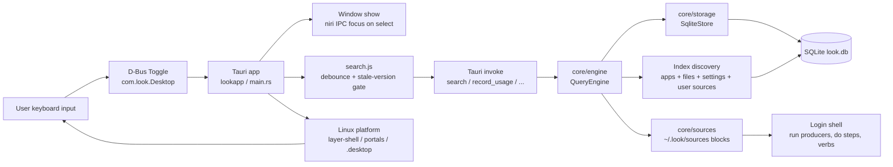
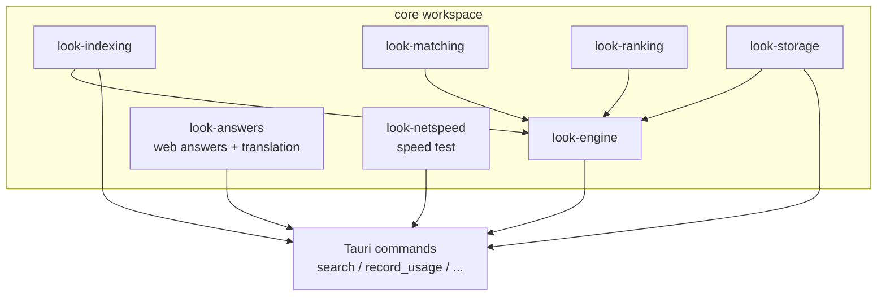
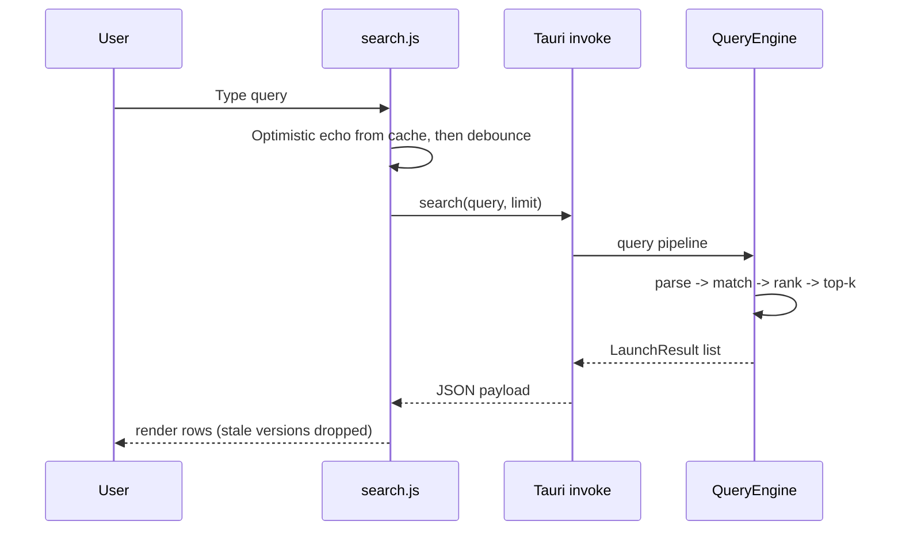
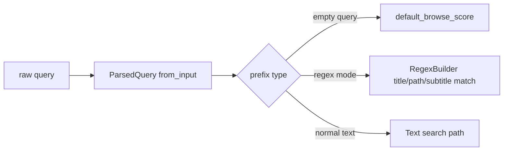
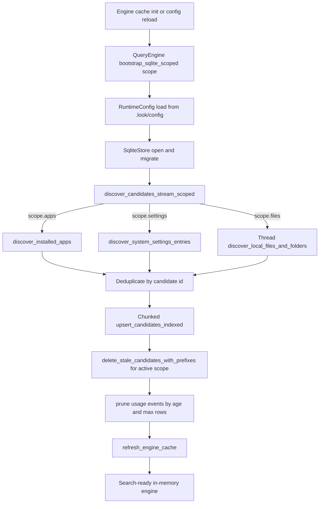
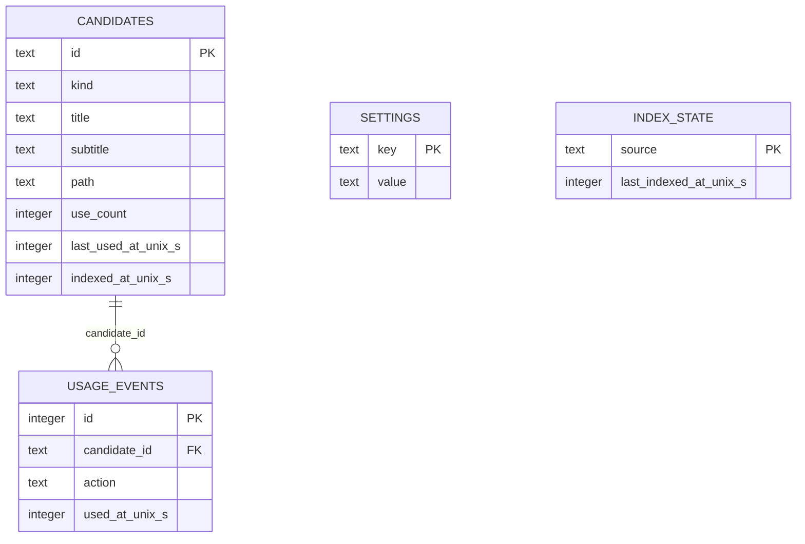
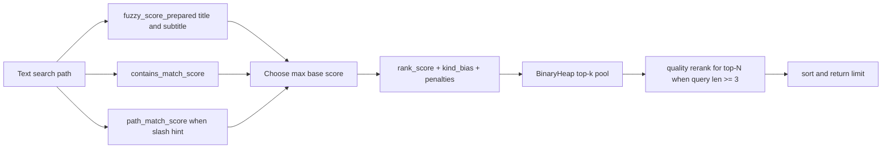
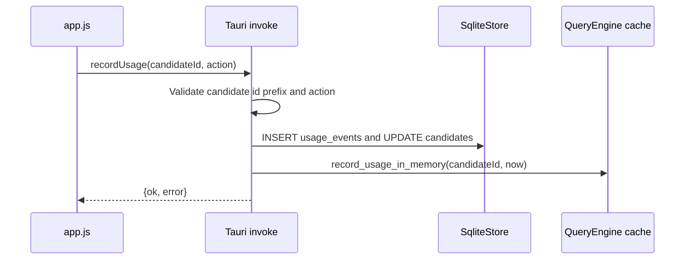
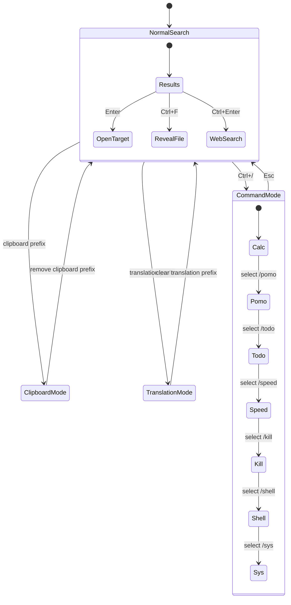

# Architecture Guide

This is the canonical architecture document for `niri-search`.

It intentionally merges architecture explanation and diagrams into one place, so design decisions and Mermaid views stay in sync.

## 1) System overview and design intent

`niri-search` is a keyboard-first launcher for Linux (Niri-first) designed for low-latency local search. The architecture separates UI concerns from search/index/ranking concerns (Rust), joined through Tauri commands. One shell, one core:

- **Shell:** Tauri 2 app with a vanilla HTML/CSS/JS frontend under `apps/linows/` (binary `lookapp`), talking to the Rust core via Tauri commands. No FFI layer, no second shell.
- **Core:** shared Rust workspace under `core/` (engine, indexing, matching, ranking, storage, answers, calc, netspeed, qactions, sources, todo, tools), linked directly as crate dependencies.

Every query runs the same Rust core, so search, indexing, ranking, and storage behave identically wherever the app runs.

Key design goals:

- low per-keystroke latency,
- predictable behavior as candidate volume grows,
- practical relevance via text quality + usage/recency,
- local-first storage and processing,
- narrow, stable bridge between frontend and backend.

---

## 2) Module boundaries and responsibilities

- `apps/linows/src-tauri/src/`: Tauri backend - `main.rs` (entry, plugins, D-Bus toggle service), `commands.rs` (search, open, reveal, window, quit), `state.rs` (engine cache, scoped-refresh watcher), `config.rs` (`~/.look/config` persistence), `platform/linux/` (icons, WM detection, Wayland shortcuts, compositor blur, autostart), plus feature modules (clipboard, calc, music, process, sysinfo, todo, netspeed, translate, weburl, tools, qactions).
- `apps/linows/src/`: vanilla frontend (ES modules, no bundler) - `app.js` (main controller, input handler, optimistic echo), `search.js` (debounce + version-gated publish), `ipc.js` (Tauri invoke wrappers), `components/` (results, preview, ai-answer, running-apps, …), `screens/` (settings, commands), `css/` (CSS custom-property theming).
- `core/answers`: network-backed "web answer" lookups (DuckDuckGo, Wikipedia, currency/weather/crypto, suggestions, translation). Best-effort and panic-free: every entry point returns "no answer" on failure, with cheap network-free pattern-gating (`has_match`) so callers can fire speculatively while typing. No async runtime - HTTP is a blocking `curl` subprocess.
- AI on linows is web answers plus the `>` session, not a local brain: `core/answers` feeds the answer card and suggestions, and the conversation UI (`components/ai-answer*`) talks to a provider (Ollama). There is no `core/ai` crate in this tree. Apple-framework features (Calendar, Reminders, Contacts, Apple Intelligence) have no Linux counterpart and are unavailable.
- `core/sources`: user-declared source blocks. Parsing (`def.rs`), reading the sources directory (`load.rs`), turning a block into rows (`collect.rs`, `rows.rs`), performing steps through the user's login shell with shell-escaped placeholder substitution (`run.rs`), and the block-verb-before-preferred-tool rule (`tools.rs`). Parsing and collection are pure; process execution is the shell's seam, so a `run` block's command is spawned by the shell and its rows handed back through `core/engine`'s row cache. `example.toml` is the annotated format reference, asserted against the parser by a test. See `docs/user-sources.md`.
- `core/indexing`: candidate model and indexing helpers used by engine/storage flows.
- `core/matching`: exact/prefix/fuzzy matching primitives.
- `core/ranking`: ranking helpers (usage/recency-aware adjustments and score composition).
- `core/storage`: SQLite integration, schema/migrations, candidate/usage persistence.
- `core/todo`: shared store for the `/todo` command. Owns the `todo_tasks` table inside the app's existing `look.db` (full-set load/save, one-year retention), reached via the Tauri command layer. `examples/seed.rs` fills a dev database with demo history, including near-today extension-window cases for `/todo` UI testing.
- `core/netspeed`: the `/speed` measurement. A latency probe (the best of several TCP handshakes against a pre-resolved address, rather than a subtraction of two of curl's cumulative timers, whose order is not portable across curl builds), download and upload phases (four parallel `curl` streams each), and the plain-language verdicts and display strings the UI prints. Cloudflare's keyless endpoints are the primary source; when they rate-limit a connection the download phase falls back to the nearest of several public test mirrors, ranked by a round-trip probe. No async runtime, and every phase is timeout-bounded. Reached via the Tauri command layer.
- `core/engine`: query parsing, indexing orchestration, scoring, top-k retrieval, in-memory cache management.

---

## 3) Request path and query understanding

Search request path:

Query mode parsing in engine supports explicit prefixes:

- `a"` app-only,
- `f"` file-only,
- `d"` folder-only,
- `r"` regex mode,
- empty query browse mode.

Normalization uses Unicode decomposition and diacritic folding to improve matching consistency across accented input.

---

## 4) Indexing and persistence lifecycle

The indexing flow is designed as a bounded pipeline:

- discover candidates from apps/files/settings,
- deduplicate by id,
- chunked upsert to SQLite,
- delete stale entries,
- prune usage history,
- refresh in-memory cache for fast queries.

Runtime refresh triggers:

- file-system watcher monitors configured app/file roots and marks in-memory `index_dirty` on create/remove/rename events,
- launcher open (`Alt+Space`) requests background refresh through a Tauri command,
- refresh execution mode depends on `lazy_indexing_enabled`:
  - `true`: run only when dirty,
  - `false`: run on every launcher open request.

Watcher policy (linows, see `apps/linows/src-tauri/src/state.rs`):

- **apps roots** (`/usr/share/applications`, `~/.local/share/applications`, `XDG_DATA_DIRS/applications`) - watched **recursively** (small directories, cheap),
- **file roots** (`~/Documents`, `~/Downloads`, `~/Desktop`, `file_scan_extra_roots`) - watched **non-recursively** to bound inotify watch count on large trees; deep-tree changes reconciled on next launcher-open refresh,
- **noise filter** suppresses events whose every path is a synthetic file (vim `.swp`, browser `.crdownload`/`.part`, Office `~$lock`, OS droppings),
- **debounce** (2 s) coalesces bursts before firing a refresh,
- **cooldown** (10 s) caps watcher-triggered refresh rate at ≤ 6/min; explicit launcher-open refreshes bypass it,
- **scoped refresh** - `QueryEngine::bootstrap_sqlite_scoped(path, scope)` re-walks only the dirty source family (apps-only / files-only / all). Stale deletion is scoped to the same id prefixes so unrelated rows survive,
- **off-thread reindex** - the watcher loop spawns a worker thread to run the bootstrap, so subsequent events keep draining instead of queuing in the kernel buffer,
- **RAII slot guard** ensures a panic inside the worker still releases the in-progress flag.

Benchmarks for this path live in `tools/perf/` (see [tools/perf/WATCHER_PERF.md](../tools/perf/WATCHER_PERF.md)).

Persistence model:

---

## 5) Ranking, actions, and feedback loop

Search ranking combines multiple signals:

- fuzzy title/subtitle matching,
- contains/token and path matching,
- usage/recency-aware score adjustments,
- kind bias and path depth penalties,
- bounded top-k selection and optional rerank.

Usage recording closes the loop by updating persistent and in-memory state after open actions:

---

## 6) UI behavior, operational notes, and performance targets

UI interaction modes:

Behavioral notes:

- global hotkey `Alt+Space` toggles launcher visibility,
- web search is explicit handoff (`Ctrl+Enter`),
- clipboard history mode is frontend-side and in-memory for current session,
- command mode supports `calc`, `pomo`, `todo`, `speed`, `kill`, `shell`, `sys` (Ctrl+1-7 follow catalog order),
- settings panel controls theme/index/runtime knobs and persists locally.

---

## 7) Theme System

The theme system uses semantic color tokens for consistent theming across all built-in themes:

### Color Hierarchy

- **Main text (`fontColor`)**: Primary text color, user-configurable via font RGB sliders
- **Secondary text (`secondaryTextColor`)**: Section headers, labels
- **Muted text (`mutedTextColor`)**: Hints, subtitles, less important text
- **Panel fill (`panelFillColor`)**: Input fields, panels
- **Control fill (`controlFillColor`)**: Buttons, controls
- **Divider (`dividerColor`)**: Borders, separators
- **Selection (`selectionFillColor`)**: Selected item highlight
- **Accent (`accentColor`)**: Links, interactive elements
- **Success/Warning/Danger**: Semantic state colors

### Text Color Derivation (Custom Mode)

In "Custom" mode, semantic text colors auto-derive from main text color:
- Secondary = 82% brightness of main text
- Muted = 64% brightness of main text

This ensures good contrast whether using light or dark themes.

### Built-in Themes

Available themes (selected via Settings > Appearance):
| Theme | Description |
|-------|-------------|
| Catppuccin | Warm pastels (Mocha variant) |
| Tokyo Night | Dark with vibrant accents |
| Rose Pine | Soft pink-tinted dark theme |
| Gruvbox | Retro warm tones |
| Dracula | Classic purple-accented dark |
| Kanagawa | Japanese-inspired dark theme |
| Kindle | Paper and ink, e-reader light theme (serif) |
| Liquid | Clear glass surface, translucent fills |
| Custom | Auto-derived semantic colors from tint |

Themes are defined in `apps/linows/src/css/theme.css`, one
`:root[data-theme="…"]` block per preset, with `js/screens/settings.js`
mirroring the raw slider values in `THEME_PRESETS`.

A preset declares its appearance (dark or light): dark themes darken the
opaque command-mode surfaces and pane scrims, light themes lighten them. A
preset may also declare a font; presets that do not reset the font to the
app default when applied.

A preset also declares a surface (classic or liquid), the second
non-token axis alongside appearance: it selects how surfaces are drawn
rather than what colour they are, and scales every themed corner radius
through `--surface-radius-scale`. Any new border or radius on a themed
surface must go through that scale, or it desyncs from the fill behind it
and draws a stray line across the corners.

`themeSurface()` resolves the axis from the surface key first and the
preset second. That is deliberate: `savedThemeName()` stops recording
`ui_theme` as soon as any value diverges from its preset (the load path
applies the theme *over* the individual `ui_*` keys, so a stale name
would discard the user's tweaks), while `ui_surface` persists on its own.
Keying off the surface means a customised Liquid theme keeps its glass
across a relaunch.

Appearance is not a flag in the CSS: a light preset flips the `--lift` /
`--shadow` RGB triplets that stand chips off the backdrop and seat panes
on it, and repaints the semantic tokens the dark presets inherit from
`:root`. Opacities are the user's (`USER_CONTROLLED_KEYS`) except at one
moment: picking a preset whose surface *is* its transparency snaps
tint/text/border opacity back to the preset (`OPACITY_OWNING_THEMES`),
because paper at a dark theme's transparency doesn't read as paper and
glass at a near-opaque one is a blue panel. The switch persists those
values, so restore paths stay dumb and the sliders are the user's again
from the next drag. Kindle's font stack stays in CSS and applies while
the Font field is left at `system-ui`; an explicit font still wins.

The surface axis is `data-surface="liquid"` on the document element,
beside `data-theme`, with `css/liquid.css` carrying it. It is stored under
its own config key (`ui_surface`) rather than derived from the theme name:
nudging any slider drops `ui_theme` to `custom`, and the surface must not
go with it. The radius scale is one custom property
(`--surface-radius-scale`) that every themed radius multiplies through -
`--corner-radius`, `--control-radius`, `--tile-radius`, `--bar-radius` -
so a radius that skips the scale is a rule that hardcodes a px value, not
a call site that forgot a helper.

The material itself does not port. `backdrop-filter` blurs what the web engine
composited behind the element, and the desktop behind a `transparent: true`
window is composited by the OS, outside the webview; refraction has no CSS
primitive at all. So linows renders Liquid as clear glass rather than frost:
high transparency, a specular rim drawn as an overlay pseudo-element (above the
tint and the background image, and a hairline whatever the user's border
thickness), and saturated accents. Nothing in it needs the compositor, so it
looks the same everywhere.

Real frost is available where the compositor grants it, and only there.
`platform/linux/blur.rs` asks: on Wayland through `ext-background-effect-v1`
(the cross-desktop staging protocol - KWin 6.7+, Hyprland 0.56+, Niri) falling
back to `org_kde_kwin_blur`, which Plasma spoke until 6.7; on X11 through the
`_KDE_NET_WM_BLUR_BEHIND_REGION` property, which only KWin reads. The Wayland
bind (`blur_wayland.rs`) attaches to GTK's own `wl_surface`, taken off the
window handle rather than through GDK FFI, and runs on a private event queue so
its roundtrips do not eat the events GDK is waiting for.

The Wayland request does not currently reach a native Wayland session: the
`set_blur_region` command is gated on the X11 window id, which nothing caches
when the window is not an X11 one, so the frost there is CSS only. Lifting that
gate is not enough on its own, and the notes below are what a second attempt
needs. GTK destroys the `wl_surface` on hide and makes a new one on the next
show, so the effect object bound at startup goes inert and the next
`set_blur_region` is a fatal `surface_destroyed` error, not a no-op: the object
has to be re-attached per surface. The region is double-buffered state applied
on the next surface commit, so a settled UI never publishes it. And
`getBoundingClientRect` reports the *animated* box, so a region built during the
entrance cascade is a hard-edged rectangle of frost sitting where the tile is
not, over a part of the window that paints nothing.

Two things follow from that being a capability rather than a setting. The
region comes from the frontend (`js/blur.js`), because only it knows which
surfaces are painted: one rectangle for the classic panel, one per tile once
the panes float, so the gaps stay clear instead of frosting into a single slab.
Both backends take rectangles only, so a rounded surface is approximated by the
cross of its two inset rects. And no config key is added: `PlatformInfo`
carries `compositor_blur`, which is what lets `effectiveBlurOpacity()` treat a
blurring compositor the same way it treats a background image, so the existing
Blur Style and Blur Opacity controls act on real frost when there is any.

### Motion

Every animated surface reads its physics from one `:root` block of tokens
in `src/css/motion.css` (durations, offsets, stagger, the house curve) and
the keyframes that read them, driven by classes rather than a token
counter. `js/motion.js` toggles `is-entering` on `.launcher-window` on
every summon, which cascades the panel arrival, the top bar, the
placeholder overlay and the running-apps strip; the launchpad keeps its own
replay (`components/superactions.js`) because it is built lazily.
`window-shown` and `visibilitychange` both replay, and a short guard drops
whichever lands second. The stale-buffer problem is handled by arming the
first frame on hide, so the frame the compositor presents on the next
summon matches frame 0 instead of flashing and rewinding.
Arming alone is not enough: the compositor keeps the last frame the webview
*painted*, and a hide in the same tick leaves the revealed panel in that buffer.
So every dismiss goes through `commands::hide_armed`, which emits
`window-hidden` and holds the window until the frontend acks with `confirm_hide`
from a double `requestAnimationFrame` - one frame to arm, the next to confirm it
was painted. A 60 ms timer is the backstop for a webview that never answers.
Each dismiss carries an id that `commands::show_launcher` clears, so a backstop
or late ack from a dismiss the user undid can't hide the window again.

Two constraints are easy to break. Only `transform` and `opacity`
are animated, since they are compositor-handled and animating `filter` /
`backdrop-filter` tanks the frame rate on WebKitGTK. And the selection pill's
zoom uses the `scale` property rather than a `transform` function, because
`components/results.js` drives the pill's position through `transform` and an
animation on the same property would take the glide over and land the pill
without it. `prefers-reduced-motion` is honoured throughout.

### Config File Integration

All settings are persisted to `.look/config`:

**UI Theme:**
- `ui_theme` - theme name (catppuccin, tokyoNight, rosePine, gruvbox, dracula, kanagawa, kindle, liquid). Matched case-insensitively, and applied after the individual `ui_*` keys below, so a preset overrides them. Empty means Custom. Save Config writes a preset name only while the values still match that preset, so a theme you have tweaked is stored as its literal values.

**Appearance:**
- `ui_tint_red`, `ui_tint_green`, `ui_tint_blue`, `ui_tint_opacity` - background tint (0-1)
- `ui_blur_material` - blur style. On linows the surface axis lives in `ui_surface` (empty/classic or `liquid`), not in this key.
- `ui_blur_opacity` - blur opacity (0-1). On linows this thins the tint only when there is frost to thin: a background image, or a compositor granting behind-window blur. With neither it is ignored and Tint Opacity alone decides the window alpha.
- `ui_surface` - linows only. How surfaces are drawn, as opposed to what colour they are: empty (classic) or `liquid`. Stored separately from `ui_theme` because nudging any slider rewrites that key to `custom`, and a customised Liquid must keep its glass.
- `ui_font_name`, `ui_font_size` - font settings
- `ui_font_red`, `ui_font_green`, `ui_font_blue`, `ui_font_opacity` - text color (0-1)
- `ui_border_thickness`, `ui_border_red`, `ui_border_green`, `ui_border_blue`, `ui_border_opacity` - border

**Background Image:**
- `ui_background_image` - path to image file
- `ui_background_image_mode` - fill, fit, tile, stretch
- `ui_background_image_opacity` - overlay opacity (0-1)
- `ui_background_image_blur` - blur radius

**Settings:**
- `settings_blur_multiplier` - settings panel blur (0-1)

**File Scanning:**
- `file_scan_depth` - max depth (1-12), default: 4
- `file_scan_limit` - max files (500-50000), default: 4000
- `file_exclude_paths` - comma-separated paths to exclude

**Runtime:**
- `backend_log_level` - error, info, debug
- `launch_at_login` - true/false

### Config Reload Validation

When reloading (Ctrl+Shift+;), invalid values are detected and shown:
- Values outside valid range (e.g., opacity > 1)
- Unknown theme names
- Invalid numbers

Warnings appear in banner with copy button for easy debugging.

On startup, theme is loaded from config and applied.

---

Performance targets:

- launcher appearance under ~50 ms perceived latency,
- query update under ~10 ms for top-N from memory,
- near-zero idle CPU,
- stable memory footprint.
